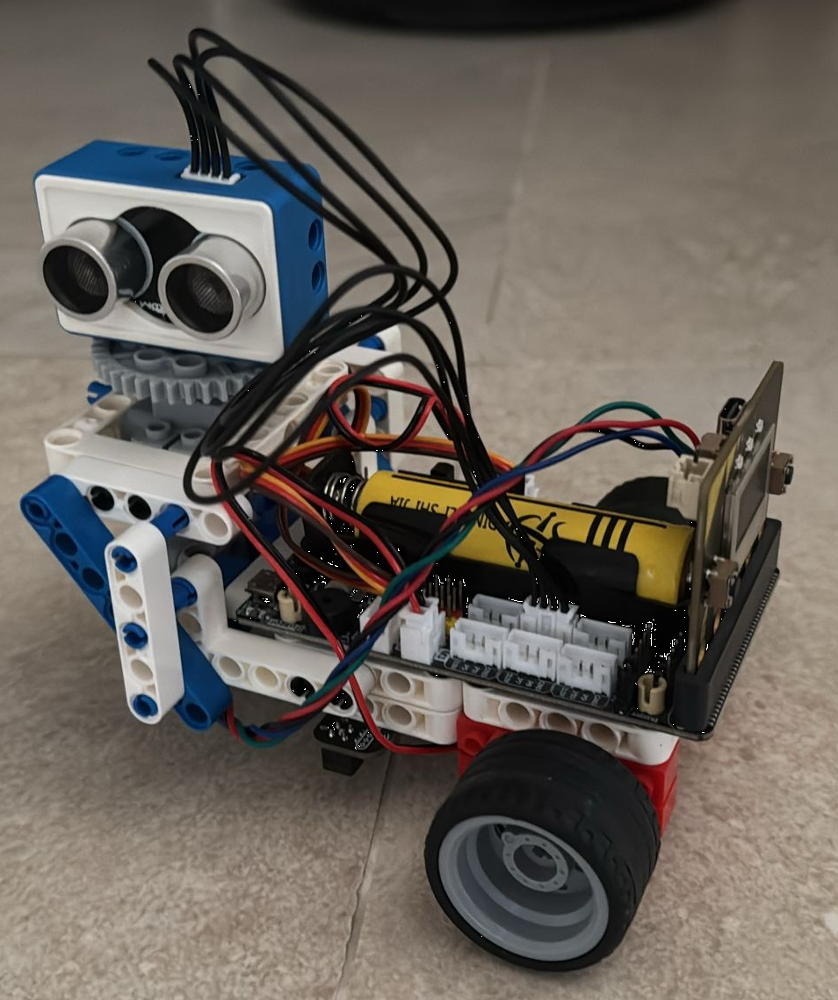

# Simple Robot
This project contains a simple robot control software. The robot is constructed on a `Yahboom` STEM kit that includes a `Microbit V2` controller adn a Super:bit extension board ver 2. I replaced the `BBC Microbit V2` as it under powered and lacks RAM, WiFi and is a very slow. The `Microbit V2` was released be `Matrix:Bit ON3` from an unknown manufacturer. The `Matrix:Bit ON3` has a ESP32 MCU and some nice prehiferial on board. What was missing is documentation. The supplier was unable to produce the documentation and since there manufacturer is un know i was unable to obtain it. I had to test/explore the unit to obtain the Missing info. I have put together a simple differential drive robot with some sensor. The kit's main drawback is the DC motors have no odometer so driving the a rout is tricky.
Programming The robot uses MicroPython 1.26.1 (may change in the future)



# Matrix:Bit ON3 Info
1) The Unit has a BBC Micro:bit form factor with a compatible edge connector.
2) The MCU is an ESP32 WROOM with:
   1. Xtensa dual-core 32-bit LX6 microprocessor, up to 240 MHz
   2. 520M RAM
   3. 4M Flash
   4. WiFI 2.4G and Bluetooth (BLE) V4.2
   5. GPIO:  UART, SPI, SDIO, I2C, LED PWM, Motor PWM, I2S, IR, pulse counter, GPIO, capacitive touch  sensor, ADC, DAC, TWAI® (compatible with ISO 11898-1, i.e. CAN Specification 2.0)
3) Onboard devices
   1) 3x1  NEOPIXEL LEDS at GPIO PIN 17 (same oad the Super:bit 4x1 NEOPIXEL LEDS on it)
   2) Gyro & Acetometer QMI8656 on I2C address 0x6B
   3) Compass (Magnetometer) MMC5983 on I2C address 0x30
   4) Light sensor on GPIO pin 39
   5) Microphone on GPIO pin 36
   6) Speaker on pin 16
   7) OLED display SSD1306 (128x64) on I2C address 0x3C
   8) Button A GPIO pin 0 (Boot Mode)
   9) Button B GPIO pin 2
   10) 6 Touch pads Letters touch pins P-23, Y-24, T-25, H-26, O-27, N-28

# Yahboom Superbit Extension Board and Senores
1) LED/PWM SPI controller PCA9685 on I2C address 0x40, Used to control DC motors and servo
2) 4x1 NEOPIXEL LEDS at GPIO `Microbit` Edge connector P12 (GPIO 17)
3) Ultrasonic range finder HC-SR04 on Microbit Edge connector P1 (GPIO 34), P2 (GPIO 35)
4) Line following sensor on I2C address 0x50
5) I2C from MCU board is on `Microbit` Edge connector SCL P19 (GPIO 22), SDA P20 (GPIO 23)
6) 2 x Red DC motors 
7) 1 X Servo 270 deg.

# Directory organization
```
`[robot]-|
         |-[app]
         |-[boards]-|
         |          |-[matrixbit_on3]
         |
         |-[devices]-|
         |           |-[buzzer]
         |           |-[display]
         |           |-[imu]
         |           |-[magnetometer]
         |           |-[motors]
         |           |-[servos]
         |           |-[ultrasonic]
         |
         |-[mbit_ext]
         |-[ota]
         |-[restful_api*]
         |-[restful_api_client**]
         |-[tasks]
         |-[utils]
         |- calibration.json
         |- config.py
         |- main.py
         |- README.MD
```
__Note__ * :  may change after refactoring

__Note__ **: No ton MCU, only use on host to control robot

# FRS [TBD]

