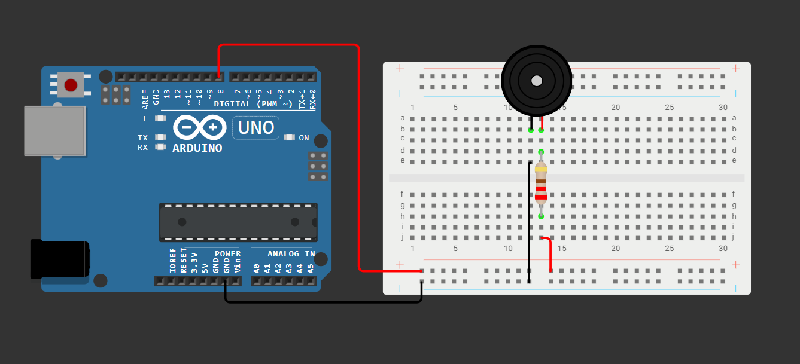
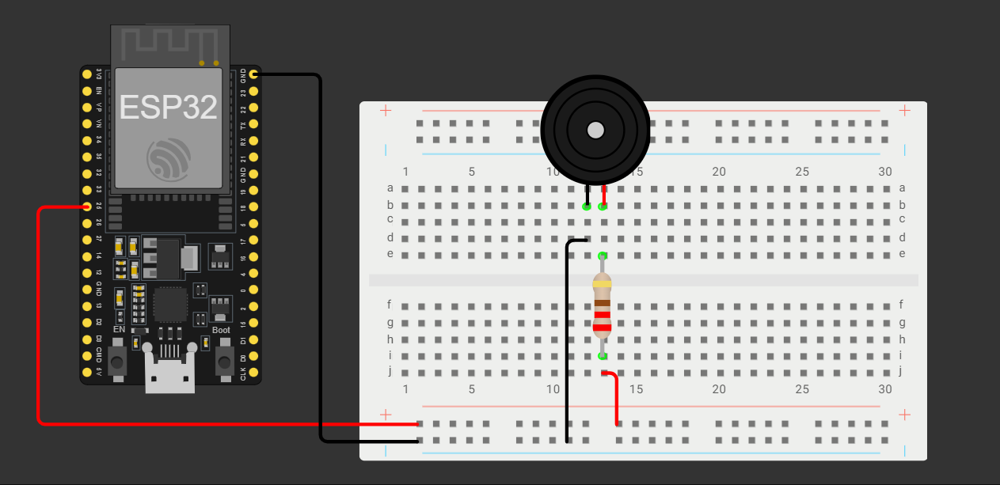

# MIDI-TO-ARDUINO-CONVERTER

A Python script by **Vihanga Nethmaka** that converts single-track MIDI files into ready-to-use C/C++ arrays (`melody_data.h`) for playing music on microcontrollers like **Arduino Uno** and **ESP32** using the `tone()` function.

## 1. How to Use the Converter (`app.py`)

Unlike command-line converters, this script uses a simple configuration variable, making the workflow extremely straightforward.

### Prerequisites (Software)

1. **Python:** Ensure you have Python 3.x installed.

2. **Mido Library:** You need the `mido` library to read and parse MIDI files. Install it using pip:

```

pip install mido

```

### Conversion Steps

1. **Select MIDI File:** Place your desired single-track MIDI file (e.g., `my_new_song.mid`) into the same root directory as the `app.py` script.

2. **Edit `app.py`:** Open the `app.py` file and locate the configuration section near the top. You **must** change the `MIDI_FILENAME` variable to the **exact name** of your MIDI file (the currently selected line in your Canvas):

```

# Example Change:

MIDI_FILENAME = "my_new_song.mid"

```

3. **Run the Script:** Execute the Python file from your terminal:

```

python app.py

```

4. **Find the Output:** The script will automatically create a folder named `MIDI_Tune_Player` (if it doesn't exist) and place the generated code in:

```

MIDI_Tune_Player/melody_data.h

```

*(Note: If a `melody_data.h` file already exists, the script will automatically back it up to the `MIDI_Tune_Player/Backups` folder before generating the new one.)*

## 2. Circuit Setup for Buzzer Playback

This project uses a simple passive piezoelectric buzzer. The connection is straightforward, but adding a resistor is recommended for component protection.

### Components Needed

* Arduino Uno or ESP32 Development Board

* Passive Piezoelectric Buzzer

* Jumper Wires

* **Current-Limiting Resistor (**$\approx 220 \text{ Ω}$ **recommended)**

### Wiring Instructions and Microcontroller Specifics

**Safety Note:** Using a current-limiting resistor (like $\mathbf{220 \text{ Ω}}$ or similar, such as $\mathbf{100 \text{ Ω}}$ to $\mathbf{330 \text{ Ω}}$) in series with the positive lead of the passive piezo buzzer is a **best practice** for protecting the microcontroller's digital pin from back EMF.

### Part A: Arduino Uno Circuit

The Arduino Uno uses the standard `tone()` function.

#### Arduino Uno Wiring

1. Connect one end of the **Resistor** to **Digital Pin 8** on the Arduino Uno.

2. Connect the other end of the **Resistor** to the **Positive (+) lead** of the Passive Buzzer.

3. Connect the **Negative (-) lead** of the Passive Buzzer to a **GND pin** on the Arduino Uno.



#### Storage Warning (Arduino Uno)

The Arduino Uno has limited Flash memory (typically $32 \text{ KB}$). Since the converted music data arrays are stored using the `PROGMEM` keyword (Flash memory), long songs can easily consume all available storage.

* **Be aware** that a melody with several hundred notes might exceed the memory limit of the Uno. Consider using shorter MIDI files or upgrading to a board with more flash memory (like an ESP32 or Arduino Mega) for complex pieces.

### Part B: ESP32 Circuit

The **ESP32** uses the powerful LED Control (LEDC) peripheral for high-precision tone generation, which is handled **automatically** by the standard Arduino `tone()` function used in the sketch.

#### ESP32 Wiring

1. Connect one end of the **Resistor** to **GPIO Pin 25** on the ESP32 Development Board.

2. Connect the other end of the **Resistor** to the **Positive (+) lead** of the Passive Buzzer.

3. Connect the **Negative (-) lead** of the Passive Buzzer to a **GND pin** on the ESP32.



#### Wiring Diagrams Summary

| **Board** | **Connection Details** | **Digital Pin Constant** | 
| ----- | ----- | ----- | 
| **Arduino Uno** | Buzzer (via Resistor) to **Digital Pin 8** and GND. | `const int BUZZZER_PIN = 8;` | 
| **ESP32** | Buzzer (via Resistor) to **GPIO Pin 25** and GND. | `const int BUZZZER_PIN = 25;` | 

## 3. Example Files and Copyright Information

This repository may contain MIDI files and corresponding converted arrays for demonstration purposes.

* **Example 1 (Provided as MIDI):** IRIS OUT (Chainsaw Man - The Movie: Reze Arc Opening)

* **Source:** `https://www.midishow.com/en/midi/download?id=229556`

* **Example 2 (Provided as C Array):** Darling in the FRANXX - Kiss of death

* **Source:** Original MIDI obtained from `https://www.hamienet.com/midi49214_Darling-in-the-FRANXX-Kiss-of-death.html`

**Important Copyright Notice:** The MIDI files used in this project are based on copyrighted original musical compositions. These examples are provided *solely* for **educational and personal use** to demonstrate the functionality of the Python script. If you intend to use any generated musical data for public performance, distribution, or commercial purposes, you are responsible for obtaining the necessary licenses and permissions from the original copyright holders.

## 4. Licensing and Attribution

### Author & Contributor

This project was created and is maintained by:

**Vihanga Nethmaka**

* **GitHub:** <https://github.com/VihangaNethmaka>

### License **MIT**
[](LICENSE)
